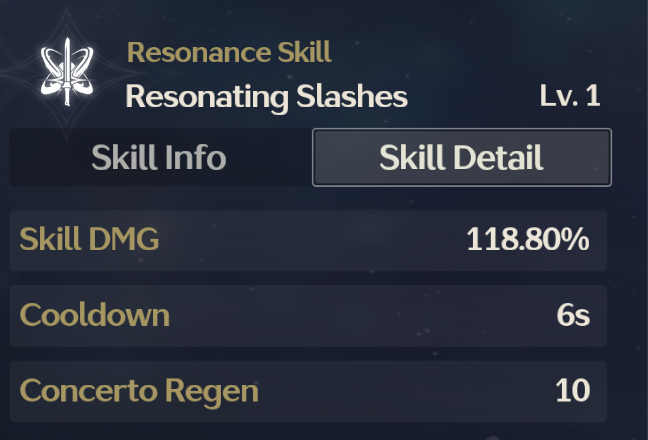
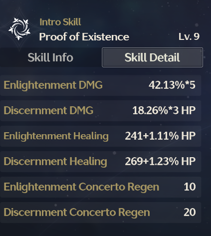
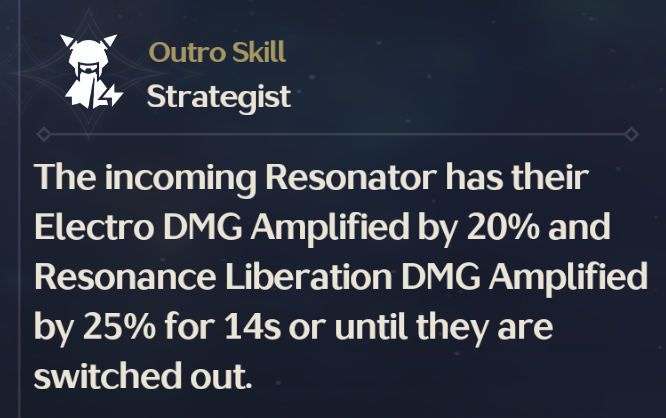
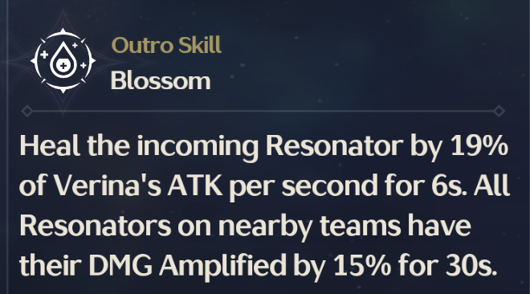
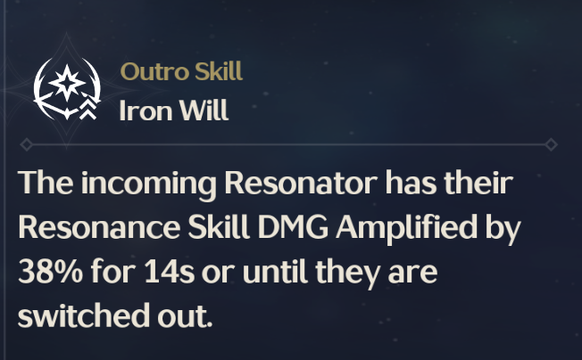

# Lore dump

## Damage calculation

### Quick Notes
Whenever this guide talks about multiplying, it may use a coefficient or a percentage. Keep in mind that using the percentage means:
```math
X \times Y\% = X \times \frac{Y}{100} \equiv X \times Y = X \times 100Y\%
```

Dont mess up thinking that 110% * 1000 is 110000, it is 1100.

See [WuWa damage calculation guide](https://wutheringwaves.fandom.com/wiki/Damage)

$${
% colors: 
% glacio: #36b0d0
% fusion: #c82a4b
% electro: #aa35b5
% aero: #31c9a1
% spectro: #b8a81e
% havoc: #971654
}$$


The damage of a hit can be calculated as follows:
```math
DMG = Base DMG \times Resistances \times Bonuses
```

Where *Base DMG* is the calculated damage of the skill alone and *Resistances* and *Bonuses* are the multipliers that affect the damage.

### Base DMG

It is calculated base damage. Calculated as follows:

```math
Base DMG = Ability Attribute * \%MV + Flat DMG + \%Flat Bonus
```

Where *Ability Attribute* is the multiplier of the displayed ability, and *%MV* is the Motion Value (The stat with which the ability scales).
See Spectro Rover's Resonance Skill:

.

This skill has an *Ability Attribute* of 118% and it scales off ATK (if nothing is specified, it scales off ATK). If this rover had 1000 atk, the *Base DMG* would be 118% of 1000, or **1180**.

See Shorekeeper's Intro Skill:

.

We'll calculate the Discernment DMG. This skill has an *Ability Attribute* of 18.26%\*3 (this means 3 hits, we can assume a hit that deals \*3 damage because the optimizer calculates average damage), so let's assume an *Ability Attribute* of 54.78%. And it scales off HP, so if Shorekeeper has 1000 HP, the *Base DMG* would be 54.78% of 1000, or **547.8**.

#### Flat DMG and %Flat Bonus
No clue, assuming its constant for every character, the optimizer doensn't need to know this.

According to the guide:
> It is an amount of additional DMG which is added to Base DMG.

### Resistances
There is a whole section in the guide about resistances, but the optimizer doesn't need to know this. The optimizer only optimizes the damage output, so it doesn't need to know how the damage is reduced.

### Bonuses
The bonus multipliers are calculated as follows:

```math 
Bonuses = \%DMG Bonus \times \%DMG Amplify \times \%Special DMG \times Crit DMG Bonus
```
#### %DMG Bonus
This is the sum of all the DMG bonuses, including Elemental DMG Bonuses and different Atk Bonuses. All bonuses are:

+ Elemental Bonuses
    + $${\color{#36b0d0}\textbf{Glacio DMG Bonus}}$$
    + $${\color{#c82a4b}\textbf{Fusion DMG Bonus}}$$
    + $${\color{#aa35b5}\textbf{Electro DMG Bonus}}$$
    + $${\color{#31c9a1}\textbf{Aero DMG Bonus}}$$
    + $${\color{#b8a81e}\textbf{Spectro DMG Bonus}}$$
    + $${\color{#971654}\textbf{Havoc DMG Bonus}}$$
+ Dmg Bonuses
    + **Basic Attack DMG Bonus%**
    + **Heavy Attack DMG Bonus%**
    + **Resonance Skill DMG Bonus%**
    + **Resonance Liberation DMG Bonus%**

The final Bonus is calculated as follows:

```math
\%DMG Bonus = \sum_{i} \text{Bonus}_i + 100\%
```
There is an implicit 100% so that the damage is not less than the base damage. (If working with coefficients, this would be 1)

See yinlin Outro Skill:

.

In this case, the incoming resonator has a bonus on their Resonance Liberation and Electro damage, so if they were Electro and did Resonance Liberation, the bonus would be 20% + 25% = 45%. so the final damage would be 145% of the base damage.

#### %DMG Amplify
Damage Amplify is displayed as **DMG Deepen** in-game. It is calculated as follows:

```math
DMG Amplify_{Total} = DMG Amplify_{Target} + DMG Amplify_{Atacker} + 100\%
```
There is also a deepen for enemies because it can be negative and would act as some kind of resistance, but as this number doesnt change the optimizer doesn't need to know this. Deepen may act on all damg, like Verina's Outro Skill:



Or could act on a specific type of damage like Taoqi's Outro Skill:



Or could act on a specific element like Aalto's Outro Skill:


#### %Special DMG
Quoting the guide:
> Special DMG is an independent multiplier which is not displayed anywhere on the in-game Character Stat page[...]
Note that currently it is unknown as to what differentiates Special DMG from DMG Amplify, and the stat remains unused in the game.

So no need to include this in the optimizer.

#### Crit DMG Bonus
In-game, a hit may crit or not crit, but the optimizer will take the average damage. This is calculated very easily:

```math
Crit DMG Bonus = Crit Rate \times Crit DMG
```

Note that in Genshin Impact, Crit damage has an implicit 100%, but not in Wuthering Waves. So reading 250% crit damage means dealing 2.5 times the damage, not 2.5 MORE damage.

## Stats

### All stats

+ HP
    + ***HP***
    + ***HP%***
+ ATK
    + ***ATK***
    + ***ATK%***
+ DEF
    + ***DEF***
    + ***DEF%***
+ ***Energy Regen%***
+ ***Crit. Rate%***
+ ***Crit. DMG%***
+ ***Healing Bonus%***
+ Elemental Bonuses
    + $${\color{#36b0d0}\textbf{Glacio DMG Bonus}}$$
    + $${\color{#c82a4b}\textbf{Fusion DMG Bonus}}$$
    + $${\color{#aa35b5}\textbf{Electro DMG Bonus}}$$
    + $${\color{#31c9a1}\textbf{Aero DMG Bonus}}$$
    + $${\color{#b8a81e}\textbf{Spectro DMG Bonus}}$$
    + $${\color{#971654}\textbf{Havoc DMG Bonus}}$$
+ Dmg Bonuses
    + **Basic Attack DMG Bonus%**
    + **Heavy Attack DMG Bonus%**
    + **Resonance Skill DMG Bonus%**
    + **Resonance Liberation DMG Bonus%**

### Main stats


| Stat                  | Rank 2 (LVL 1 - 10) | Rarity 3 (LVL 1 - 15) | Rarity 4 (LVL 1 - 20) | Rarity 5 (LVL 1 - 25) |
|-----------------------|---------------------|-----------------------|-----------------------|-----------------------|
| **1-Cost Echo**        |                     |                       |                       |                       |
| HP%                   | 2.8% - 7.2%         | 3.0% - 10.20%         | 3.4% - 14.2%          | 4.5% - 22.8%          |
| ATK%                  | 2.2% - 5.7%         | 2.4% - 8.1%           | 2.7% - 11.3%          | 3.6% - 18.0%          |
| DEF%                  | 2.2% - 5.7%         | 2.4% - 8.1%           | 2.7% - 11.3%          | 3.6% - 18.0%          |
| HP                    | 114 - 296           | 152 - 516             | 228 - 957             | 456 - 2280            |
| **3-Cost Echo**        |                     |                       |                       |                       |
| HP%                   | 3.7% - 9.6%         | 4.0% - 14.0%          | 4.5% - 18.9%          | 6.0% - 30%            |
| ATK%                  | 3.7% - 9.6%         | 4.0% - 14.0%          | 4.5% - 18.9%          | 6.0% - 30%            |
| DEF%                  | 4.7% - 12.3%        | 5.0% - 17%            | 5.7% - 23.9%          | 7.6% - 38%            |
| ${\color{#36b0d0}\text{Glacio DMG Bonus}}$       | 3.7% - 9.6%         | 4.0% - 14%            | 4.5% - 18.9%          | 6.0% - 30%            |
| ${\color{#c82a4b}\text{Fusion DMG Bonus}}$       | 3.7% - 9.6%         | 4.0% - 14%            | 4.5% - 18.9%          | 6.0% - 30%            |
| ${\color{#aa35b5}\text{Electro DMG Bonus}}$      | 3.7% - 9.6%         | 4.0% - 14%            | 4.5% - 18.9%          | 6.0% - 30%            |
| ${\color{#31c9a1}\text{Aero DMG Bonus}}$         | 3.7% - 9.6%         | 4.0% - 14%            | 4.5% - 18.9%          | 6.0% - 30%            |
| ${\color{#b8a81e}\text{Spectro DMG Bonus}}$      | 3.7% - 9.6%         | 4.0% - 14%            | 4.5% - 18.9%          | 6.0% - 30%            |
| ${\color{#971654}\text{Havoc DMG Bonus}}$        | 3.7% - 9.6%         | 4.0% - 14%            | 4.5% - 18.9%          | 6.0% - 30%            |
| Energy Regen           | - 10%               | 4.2% - 14.2%          | 4.8% - 20.1%          | 6.4% - 32.0%          |
| ATK                   | 12 - 31             | 13 - 44               | 15 - 63               | 20 - 100              |
| **4-Cost Echo**        |                     |                       |                       |                       |
| ATK                   | 18 - 46             | 20 - 68               | 22 - 92               | 30 - 150              |
| HP%                   | 4.1% - 10.6%        | 4.3% - 14.6%          | 4.9% - 20.5%          | 6.6% - 33.0%          |
| ATK%                  | 4.1% - 10.6%        | 4.3% - 14.6%          | 4.9% - 20.5%          | 6.6% - 33.0%          |
| DEF%                  | 5.2% - 13.5%        | 5.5% - 18.7%          | 6.2% - 26.0%          | 8.3% - 41.5%          |
| Crit. Rate             | 2.7% - 7.1%         | 2.9% - 9.8%           | 3.3% - 13.8%          | 4.4% - 22.0%          |
| Crit. DMG              | 5.4% - 14.3%        | 5.8% - 19.7%          | 6.6% - 27.7%          | 8.5% - 36.3%          |
| Healing Bonus          | - 8.5%              | 3.5% - 11.9%          | 3.9% - 16.3%          | 5.2% - 26.0%          |

### Substats


Substats are supposed to follow Gaussian distribution with the following parameters:

| Substat                      | Range of Values | Median Value |
|------------------------------|-----------------|--------------|
| ATK                          | 30 - 70         | 50           |
| HP                           | 320 - 580       | 450          |
| DEF                          | 30 - 70         | 50           |
| ATK%                         | 6.4% - 11.6%    | 9.0%         |
| HP%                          | 6.4% - 11.6%    | 9.0%         |
| DEF%                         | 8.1% - 14.7%    | 11.39%       |
| Energy Regen                 | 5.6% - 14.9%    | 10.25%       |
| Crit. Rate                   | 6.3% - 10.5%    | 8.4%         |
| Crit. DMG                    | 12.6% - 21.0%   | 16.8%        |
| Basic Attack DMG Bonus        | 6.4% - 11.6%    | 9.0%         |
| Heavy Attack DMG Bonus        | 6.4% - 11.6%    | 9.0%         |
| Resonance Skill DMG Bonus     | 6.4% - 11.6%    | 9.0%         |
| Resonance Liberation DMG Bonus| 6.4% - 11.6%    | 9.0%         |

# Data

## Format

### Echoes


we will assume lvl 25 for now

```json
{
    "name": "Name",
    "set": "Set Name",
    "main_stat": "HP%",
    "substats": {
        "HP%": 4.5,
        "ATK%": 6.0,
        "DEF%": 7.6,
        "Crit. Rate": 4.4,
        "Crit. DMG": 8.5,
        "Healing Bonus": 5.2
    },
}
```

if the echo is not level 25 and/or there are missing roles, they will be left empty and with -1:

```json
{
    "name": "Name",
    "set": "Set Name",
    "main_stat": "HP%",
    "substats": {
        "HP%": 4.5,
        "ATK%": 6.0,
        "DEF%": 7.6,
        "": -1,
        "": -1,
        "": -1
    },
}
```	

#### Sonata effects

[celestial-light]: https://static.wikia.nocookie.net/wutheringwaves/images/0/0c/Icon_Celestial_Light.png/revision/latest/scale-to-width-down/35?cb=20240602202956
[empyrean-anthem]: https://static.wikia.nocookie.net/wutheringwaves/images/3/3a/Icon_Empyrean_Anthem.png/revision/latest/scale-to-width-down/35?cb=20241221125231
[eternal-radiance]: https://static.wikia.nocookie.net/wutheringwaves/images/8/82/Icon_Eternal_Radiance.png/revision/latest/scale-to-width-down/35?cb=20241221125303
[freezing-frost]: https://static.wikia.nocookie.net/wutheringwaves/images/8/8d/Icon_Freezing_Frost.png/revision/latest/scale-to-width-down/35?cb=20240602203002
[frosty-resolve]: https://static.wikia.nocookie.net/wutheringwaves/images/9/9e/Icon_Frosty_Resolve.png/revision/latest/scale-to-width-down/35?cb=20241221124832
[lingering-tunes]: https://static.wikia.nocookie.net/wutheringwaves/images/a/aa/Icon_Lingering_Tunes.png/revision/latest/scale-to-width-down/35?cb=20240602203008
[midnight-veil]: https://static.wikia.nocookie.net/wutheringwaves/images/0/0a/Icon_Midnight_Veil.png/revision/latest/scale-to-width-down/35?cb=20241221125108
[molten-rift]: https://static.wikia.nocookie.net/wutheringwaves/images/9/95/Icon_Molten_Rift.png/revision/latest/scale-to-width-down/35?cb=20240602203014
[moonlit-clouds]: https://static.wikia.nocookie.net/wutheringwaves/images/a/a5/Icon_Moonlit_Clouds.png/revision/latest/scale-to-width-down/35?cb=20240602203022
[rejuvenating-glow]: https://static.wikia.nocookie.net/wutheringwaves/images/7/75/Icon_Rejuvenating_Glow.png/revision/latest/scale-to-width-down/35?cb=20240602203028
[sierra-gale]: https://static.wikia.nocookie.net/wutheringwaves/images/d/db/Icon_Sierra_Gale.png/revision/latest/scale-to-width-down/35?cb=20240602203034
[havoc-eclipse]: https://static.wikia.nocookie.net/wutheringwaves/images/6/6e/Icon_Sun-sinking_Eclipse.png/revision/latest/scale-to-width-down/35?cb=20240602203040
[tidebreaking-courage]: https://static.wikia.nocookie.net/wutheringwaves/images/a/a8/Icon_Tidebreaking_Courage.png/revision/latest/scale-to-width-down/35?cb=20241221125154
[void-thunder]: https://static.wikia.nocookie.net/wutheringwaves/images/1/1d/Icon_Void_Thunder.png/revision/latest/scale-to-width-down/35?cb=20240602203046

| Sonata Effect      | 2-Piece Bonus                                                                 | 5-Piece Bonus                                                                 |
|--------------------|--------------------------------------------------------------------------------|--------------------------------------------------------------------------------|
| ![Celestial Light][celestial-light] **Celestial Light** |${\color{#b8a81e}\text{Spectro DMG +10\\%}}$ | ${\color{#b8a81e}\text{Spectro DMG +30\\%}}$ for 15s after releasing Intro Skill.                         |
| ![Empyrean Anthem][empyrean-anthem] **Empyrean Anthem** | Energy Regen +10\\% | Increase Resonator's Coordinated Attack DMG by 80%. Upon critical hit, increase active Resonator's ATK by 20% for 4s. |
| ![Eternal Radiance][eternal-radiance] **Eternal Radiance** | ${\color{#b8a81e}\text{Spectro DMG +10\\%}}$ | Inflicting Spectro Frazzle increases Crit. Rate by 20% for 15s. Attacking enemies with 10 stacks of Spectro Frazzle grants 15% ${\color{#b8a81e}\text{<spectro>Spectro DMG}}$ </spectro> Bonus for 15s. |
|![Freezing Frost][freezing-frost] **Freezing Frost** | ${\color{#36b0d0}\text{Glacio DMG +10\\%}}$ | ${\color{#36b0d0}\text{Glacio DMG +10\\%}}$ after releasing Basic or Heavy Attack. Stacks up to 3 times, each lasting 15s. |
| ![Frosty Resolve][frosty-resolve] **Frosty Resolve**  | Resonance Skill DMG +12% | Casting Resonance Skill grants ${\color{#36b0d0}\text{22.5\\% Glacio DMG}}$ Bonus for 15s. Casting Resonance Liberation increases Resonance Skill DMG by 18% for 5s. Stacks up to 2 times. |
| ![Lingering Tunes][lingering-tunes] **Lingering Tunes** | ATK +10% | While on field, ATK increases by 5% every 1.5s, stacking up to 4 times. Outro Skill DMG +60%. |
| ![Midnight Veil][midnight-veil] **Midnight Veil**   | ${\color{#971654}\text{Havoc DMG +10\\%}}$ | Triggering Outro Skill deals additional ${\color{#971654}\text{480\\% Havoc DMG}}$ to surrounding enemies and grants incoming Resonator ${\color{#971654}\text{15\\% Havoc DMG}}$ Bonus for 15s. |
| ![Molten Rift][molten-rift] **Molten Rift**     | ${\color{#c82a4b}\text{Fusion DMG +10\\%}}$ | ${\color{#c82a4b}\text{Fusion DMG +30\\%}}$ for 15s after releasing Resonance Skill. |
| ![Moonlit Clouds][moonlit-clouds] **Moonlit Clouds**  | Energy Regen +10% | After using Outro Skill, increases next Resonator's ATK by 22.5% for 15s. |
| ![Rejuvenating Glow][rejuvenating-glow] **Rejuvenating Glow** | Healing Bonus +10% | Healing allies increases all party members' ATK by 15% for 30s. |
| ![Sierra Gale][sierra-gale] **Sierra Gale**     | ${\color{#31c9a1}\text{Aero DMG +10\\%}}$ | ${\color{#31c9a1}\text{Aero DMG +30\\%}}$ for 15s after releasing Intro Skill. |
| ![Havoc Eclipse][havoc-eclipse] **Havoc Eclipse** | ${\color{#971654}\text{Havoc DMG +10\\%}}$ | ${\color{#971654}\text{Havoc DMG +7.5\\%}}$ after releasing Basic or Heavy Attack. Stacks up to 4 times, each lasting 15s. |
| ![Tidebreaking Courage][tidebreaking-courage] **Tidebreaking Courage** | Energy Regen +10% | Increase Resonator's ATK by 15%. Reaching 250% Energy Regen increases all Attribute DMG by 30% for the Resonator. |
| ![Void Thunder][void-thunder] **Void Thunder**    | ${\color{#aa35b5}\text{Electro DMG +10\\%}}$ | ${\color{#aa35b5}\text{Electro DMG +15\\%}}$ after releasing Heavy Attack or Resonance Skill. Stacks up to 2 times, each lasting 15s. |


### Characters

We will assume lvl 90 for now

```json
{
    "name": "Spectro Rover", // Not used by optimizer
    "element": "Spectro",
    "base_stats": {
        "HP": 11400,
        "ATK": 375,
        "DEF": 100,
        "Energy Regen": 10,
        "Crit. Rate": 5,
        "Crit. DMG": 150,
        "Healing Bonus": 0,
        "Max Energy": 100
    },
    "elemental_bonuses": {
        "Glacio": 0,
        "Fusion": 0,
        "Electro": 0,
        "Aero": 0,
        "Spectro": 0,
        "Havoc": 0
    },
    "constellations": 0,
    "talents": {
        "basic_attack": {
            "level": 10, // 1 - 10
        },
        "resonance_skilsl": {
            "level": 10, // 1 - 10
        },
        "forte_circuit": {
            "level": 10, // 1 - 10
        },
        "resonance_liberation": {
            "level": 10, // 1 - 10
        },
        "intro_skill": {
            "level": 10, // 1 - 10
        },
        "basic_skills"{
            "left": [
                true, false // two levels
            ],
            "center_left": [
                true, false // two levels
            ],
            "center_right": [
                true, false // two levels
            ],
            "right": [
                true, false // two levels
            ],
        }
        "inherent_skills"[
            true, true // two levels
        ]
    }
}
```
